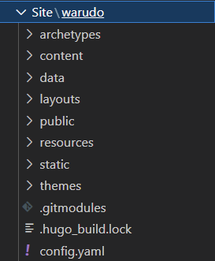
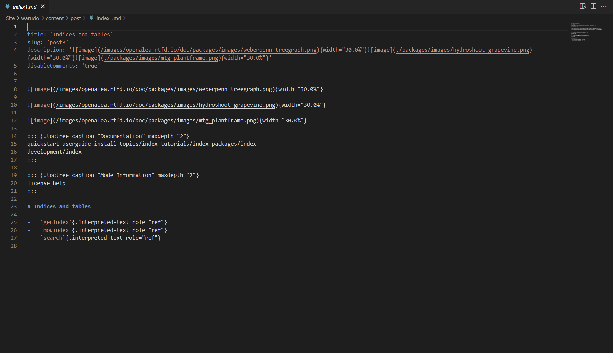

# Description

This description aim to describe the code that I wrote: how it works and its limits.

# Code

Hugo is a static site generator written in Go.

When we create a website using Hugo, we automatically create a tree of folders and files that will be used to generate the website.

In this tree we can see : 

- A `content` folder that contains all the written files (all the **text** files) -> Markdown' with a special header.

For example, this file contains a header (between the `---`) and some text (which can consist in written text or imports of static documents -> for example images).

- A static folder that contains all the static documents -> images, css, js, ...

- A data folder that contains some data files -> json, yml, ... (not the configuration file thow)

- A theme folder that contains the theme we want to use.

## The idea

The first idea consisted in doing all the task you read on the tutorial in order to build a website without writting any code.

Taking a repository on GitHub (all its documents) -> create a website out of it 

## The structure

The code is made of 4 files:

- cloneFromGit.py : contain a function which clone a repository from GitHub **&** contains all user interface functions (ask for folders / files, etc.)
- Conversion.py : contain functions made to convert files from one format to markdown -> make these files "content folder friendly" (if possible)
- write.py : contain functions made to write the files in order to give each file of the content folder a header.
- do_it.py : basically call all the other functions -> no code.

## Some explanation about the code

### Conversion.py

*pypandoc* is a Python library that allows to convert files from one format to another. It contains function such as :

- `convert_file` : Convert pandoc file from one format to another.
- `get_pandoc_formats()` : Return a list of all the formats that can be converted. See the pandoc documentation for more [information](https://pandoc.org/index.html).
    - [0] -> conversion to
    - [1] -> conversion from
We will mostly be interested in the [0] part of the list

## Basics 

Basically : 

1. Ask the user for the name of the folder where the website will be generated.
2. Ask the user for the repository to clone from GitHub.
3. Ask the user for the theme to use.
4. Copy the example configuration file and paste it in the folder where the website will be generated.
5. Convert the files.
6. Write above the files.
7. Copy the example data folder

