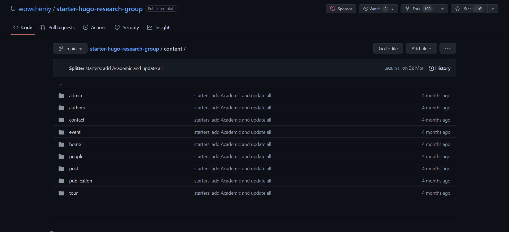

# Description

This description aim to describe the code that I wrote: how it works and its limits.

# Code

Hugo is a static site generator written in Go.

When we create a website using Hugo, we automatically create a tree of folders and files that will be used to generate the website.

In this tree we can see : 

- A `content` folder that contains all the written files (all the **text** files) -> Markdown' with a special header.

For example, this file contains a header (between the `---`) and some text (which can consist in written text or imports of static documents -> for example images).

- A static folder that contains all the static documents -> images, css, js, ...

- A data folder that contains some data files -> json, yml, ... (not the configuration file thow)

- A theme folder that contains the theme we want to use.

## The idea

The first idea consisted in doing all the task you read on the tutorial in order to build a website without writting any code.

Taking a repository on GitHub (all its documents) -> create a website out of it 

## The structure

The code is made of 4 files:

- cloneFromGit.py : contain a function which clone a repository from GitHub **&** contains all user interface functions (ask for folders / files, etc.)
- Conversion.py : contain functions made to convert files from one format to markdown -> make these files "content folder friendly" (if possible)
- write.py : contain functions made to write the files in order to give each file of the content folder a header.
- do_it.py : basically call all the other functions -> no code.

## Some explanation about the code

### Conversion.py

*pypandoc* is a Python library that allows to convert files from one format to another. It contains function such as :

- `convert_file` : Convert pandoc file from one format to another.
- `get_pandoc_formats()` : Return a list of all the formats that can be converted. See the pandoc documentation for more [information](https://pandoc.org/index.html).
    - [0] -> conversion to
    - [1] -> conversion from
We will mostly be interested in the [0] part of the list

Everything in this file turn around the `convert_file` function.
Converting multiple files to markdown -> Calling this function several times with different paths as parameters (not optimal, pypandoc includes a command which convert a tree of folders - problems using it).

### write.py

This file main issue is to deal with the header of the files (functions called when one of the files has just been converted to markdown). 

- knowing the configuration file extension is primordial to know how to write the header.
- 2 types of functions :
    - Some used during the execution of a "Convert_folder" function -> writing the header of the converted file.
    - The other functions main purpose adapt the links of the imports to the new website.
        -> In a Hugo website, the links are relative to the website structure. 
        
        Meaning, if an image is imported in a file, most of the time the image is imported with a relative path such as `../images/thing.png`.
        
        When we convert the file to markdown and place it in the content folder, we need to change this path to something like `/images/thing.png` (here the parent folder of images if the `static` folder).
    -> These functions are used after all the document style files have been converted and all the images have been placed into an `static/image` folder

### cloneFromGit.py

File made to download a repository from GitHub (we could improve it by only downloading the files we need out of a repository).
Also contains all the user interface functions (ask for directory, ask for images).
Finally, it contains functions made to copy some "example files" out of the 'theme' folder (`data` folder or `configuration` file).

### do_it.py

Just a simple python script that calls all the other functions in the right order.

## Basics 

Basically : 

1. Ask the user for the name of the folder where the website will be generated.
2. Ask the user for the repository to clone from GitHub.
3. Ask the user for the theme to use.
4. Copy the example configuration file and paste it in the folder where the website will be generated.
5. Convert the files.
6. Write above the files.
7. Copy the example data folder

This code only role is to take some files from a repository, differentiate the doc files from the static files (images, ...), convert them to markdown, write a header on top of each of them, place them (and their static files) in the "right"** hugo folder and eventually copy some data files or configuration files from the exemple often given with the Hugo theme folder.

## Problems

### Themes structuration

- The structure of the content folder of the Hugo website depend of theme used.
    - In the theme "Massively", (almost) all the markdown files should be placed in a 'post' folder.
    - In all of wowchemy' theme, the markdown files should be placed if folders as followed : 
    
    -  Other themes, do not bother with the structure of the content folder and just show everything (stack for example).
    - etc

So the output folder of the Hugo website should be taken into account before launching the code, in the `convert_folder_2_Hwebsite` function of the `Conversion.py` file, there is an parameter named `all_as_posts` which (if `all_as_posts` == 'True') will place all the converted files in a folder called 'post' (name can be change by changing line 187), it can also (if `all_as_posts` == False) just keep the original tree structure of the repository.

In many cases, some manual work is needed to make the website look like the one you want.

### Librarys used

To convert all the document-type files to markdown, we use the [pypandoc](https://pypi.org/project/pypandoc/) library (pandoc).
However, during the conversion (or during the placement of the files in the right folder), some files may keep some unecessary lines (like '::toctree' - RST file).

In the case of the notebook files, we use the `jupyter-nbconvert` command to convert the files to markdown. It removes a lot of the useless lines and gives us the opportunity (at least in theory) to execute them and to save their widgets.
    -> If the code sudenly stops when converting the notebook, it is because the command is not found.
    Note : a library called `nbconvert` seems to exist (not found).

    Other ideas :
    - nbConvert preprocessor
    - nbformat ?

### Lack of efficiency

- Too many for loops.
- Libraries used are not optimized / may have some functions "to do the job".
- Converting each file, one by one.
- Reading some files multiple times.
- (Re-)Writing some files multiple times.
- Write.py - `search_file_path` function -> strange (get_close_match).

### Errors 

- If the theme doesn't content a example file called `config.yaml` or `config.toml`
- If there is a structural probleme with the theme used 
- Librarys problems (see above)

- Error detecting the description in a document (especially if the description does not immediately follow the title) ?

## In the end

Still some manual work to do.