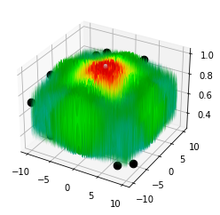

```python
import numpy as np
```

# Test de titre
Test de texte

[]: # Language: markdown
[]: # Path: Repo\example\test.ipynb


```python
a = 3
b = 9
print(a + b)
```

    12
    


```python
from copy import deepcopy
from turtle import color
import matplotlib.pyplot as plt
from matplotlib import cm
from matplotlib.ticker import LinearLocator
import numpy as np
from pyparsing import col
import math as Math

def f(X) :
    return (X[0]**2 - 10 * np.cos(2 * Math.pi * X[0])) + (X[1]**2 - 10 * np.cos(2 * Math.pi * X[1])) + 20

def f3(x) :
    return 0.5 + (np.cos( np.sin( abs(x[0]**2 + x[1]**2) ) )**2 - 0.5) / ( 1 + 0.001 * (x[0]**2 + x[1]**2))**2


def f2(x) :
    return -20 * np.exp(-0.2*np.sqrt(0.5*(x[0]**2 + x[1]**2))) - np.exp(0.5*(np.cos(2*Math.pi*x[0])+np.cos(2*Math.pi*x[1]))) + Math.exp(1)+20

from copy import deepcopy
import numpy as np
from scipy.stats import qmc
import matplotlib.pyplot as plt

# Dans un certain intervalle [a,b]
borne_Inf = -10
borne_Sup = 10
dimension_population = 50
dimension_particule = 2
a = np.ones(dimension_particule) * borne_Inf
b = np.ones(dimension_particule) * borne_Sup
# Définit la population 
pop = qmc.LatinHypercube(dimension_particule)
population = pop.random(n=dimension_population)
population = qmc.scale(population, a, b)
velocite = [[0.0 for i in range(dimension_particule)] for j in range(dimension_population)]
velocite = np.array(velocite)

k_max = 500
# Tableau des X_k
X = np.zeros(k_max)

#Tableau des Y_k
Y = np.zeros(k_max)

# Copie de X
X_lg = X

# Initialisation de mu (entre 0 et 4):
mu = 3

# Initialisation de X_0 :
X_lg[0] = 0.10

# Itération :
for k in range(1, k_max):
    X_lg[k] = mu * X_lg[k-1] * (1-X_lg[k-1]) 

F = [f(population[j]) for j in range(dimension_population)]

def peso(f, P_0, V_0, K_max, w, r, X_min, X_max):
    
    P_k = deepcopy(P_0)
    V_k = deepcopy(V_0)
    
    # Taille de la population
    dim_pop = np.size(P_0, 0)
    
    # Taille des vecteurs 
    dim_part = np.size(P_0, 1)
    
    # Array contenant le personnal best pour chaque x_i
    pb = deepcopy(P_k) 
    
    # Global best
    gb = P_k[0] 
    for i in range(dim_pop):
         if (f(gb) > f(pb[i])):
                gb = pb[i]
                
    # On itère 
    for k in range(1, K_max):
    
        # on itère pour trouver Vik+1 et Xik+1 en fonction de Vik et de Xik 
        for i in range(dim_pop):
            V_k[i,:] = w[0] * V_k[i,:] + r[k] * w[1] *(pb[i,:] - P_k[i,:]) + r[k] * w[2] * (gb - P_k[i,:])
            P_k[i,:] += V_k[i,:]
            
            # on met à jour les Xik pour qu'ils restent dans l'intervalle [Xmin,Xmax]
            for j in range(dim_part):
                
                if(P_k[i][j] > X_max):
                    P_k[i][j] = X_max
                if(P_k[i][j] < X_min):
                    P_k[i][j] = X_min
            
            # On détermine  les pb
            if(f(pb[i]) > f(P_k[i])):
                pb[i] = P_k[i]
            
            # On détermine  les gb
            if (f(gb) > f(pb[i])):
                gb = pb[i]
    
    # Au bout de K_max itérations on renvoie le global best (ce vers quoi le nuage de points converge)
    fig = plt.figure() 
    ax = fig.gca(projection='3d') 


    # Make data.
    X = np.arange(borne_Inf, borne_Sup, 0.1)
    Y = np.arange(borne_Inf, borne_Sup, 0.1)
    X, Y = np.meshgrid(X, Y)
    Z = f([X,Y])


    # Plot the surface.
    ax.plot_surface(X, Y, Z, rstride=1, cstride=1, cmap=cm.nipy_spectral, linewidth=0.08, antialiased=True, zorder = 1)

    for i in range(dimension_population):
        ax.scatter(population[i][0], population[i][1], f(population[i]), color = "black", s=75)
        ax.scatter(P_k[i][0], P_k[i][1], f(P_k[i]), color = "fuchsia", s=75, zorder = 2)

    # Add a color bar which maps values to colors.
    #fig.colorbar(ax, shrink=0.5, aspect=5)

    plt.show()
    return gb


gb = peso(f3, population, velocite, k_max, np.array([0.8, 0.8, 0.8]),X_lg , borne_Inf, borne_Sup)
print(gb)
print(f3(gb))

```

    C:\Users\gandeell\AppData\Local\Temp\ipykernel_1528\2663550913.py:107: MatplotlibDeprecationWarning: Calling gca() with keyword arguments was deprecated in Matplotlib 3.4. Starting two minor releases later, gca() will take no keyword arguments. The gca() function should only be used to get the current axes, or if no axes exist, create new axes with default keyword arguments. To create a new axes with non-default arguments, use plt.axes() or plt.subplot().
      ax = fig.gca(projection='3d')
    


    

    


    [1.22988282 0.24026579]
    0.2925786320359804
    
