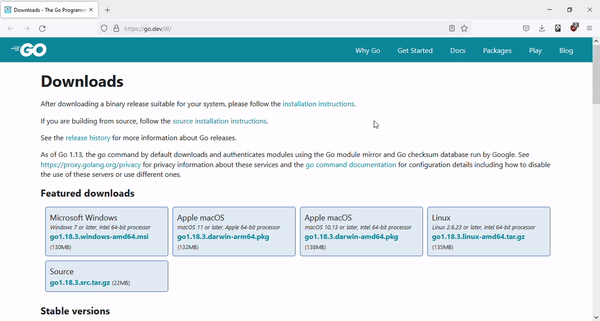
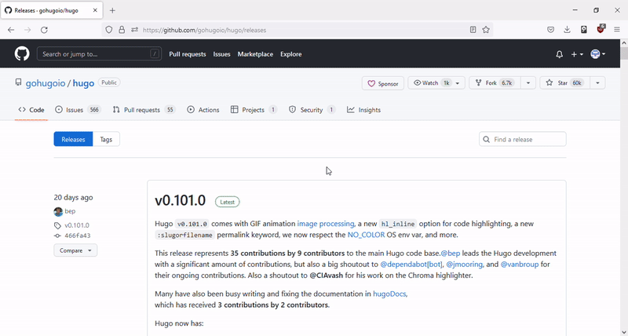
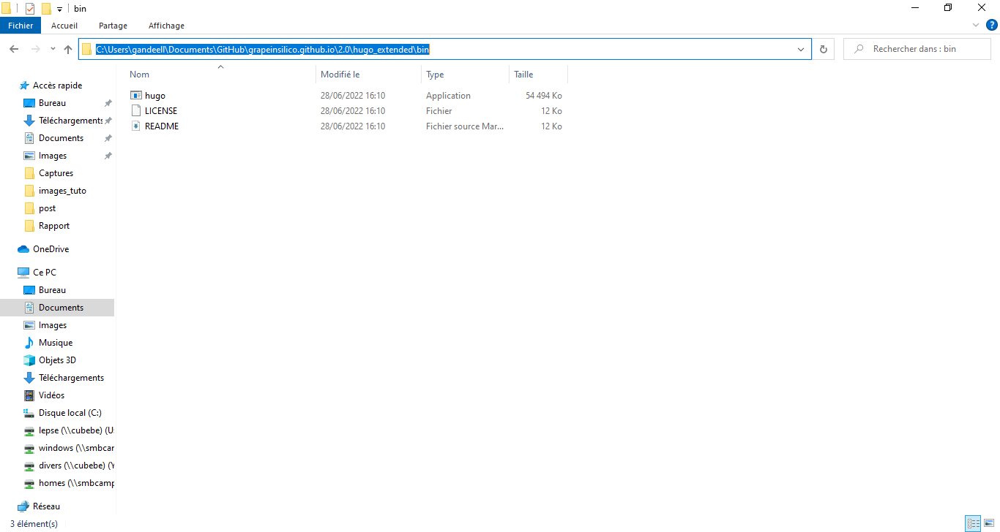
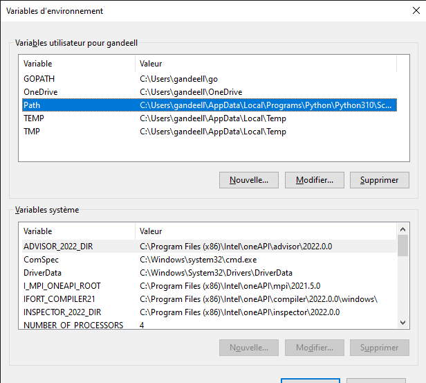
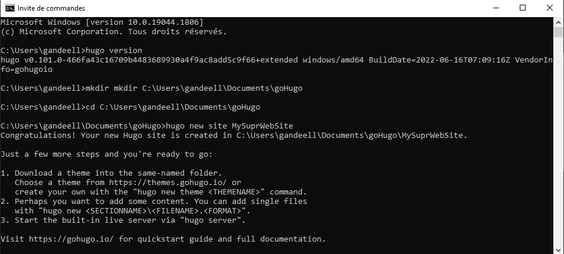
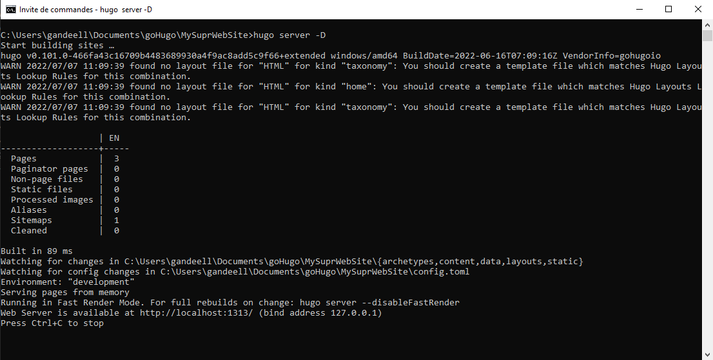
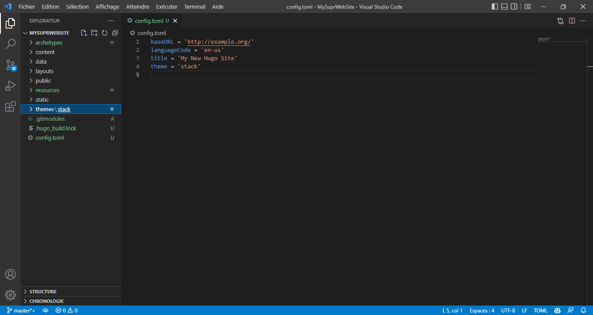
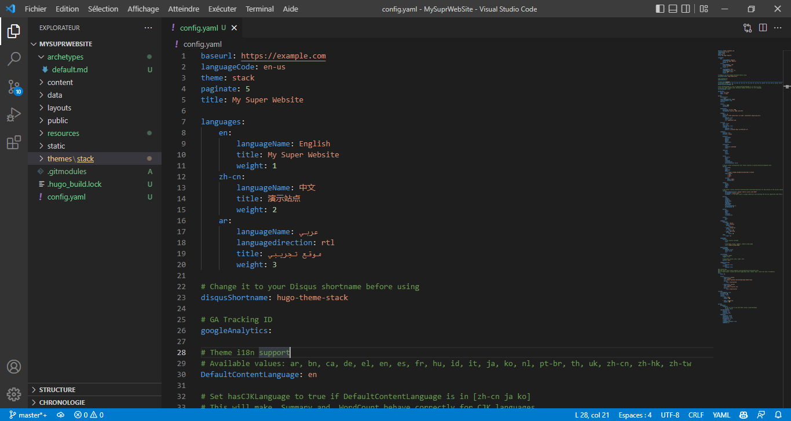
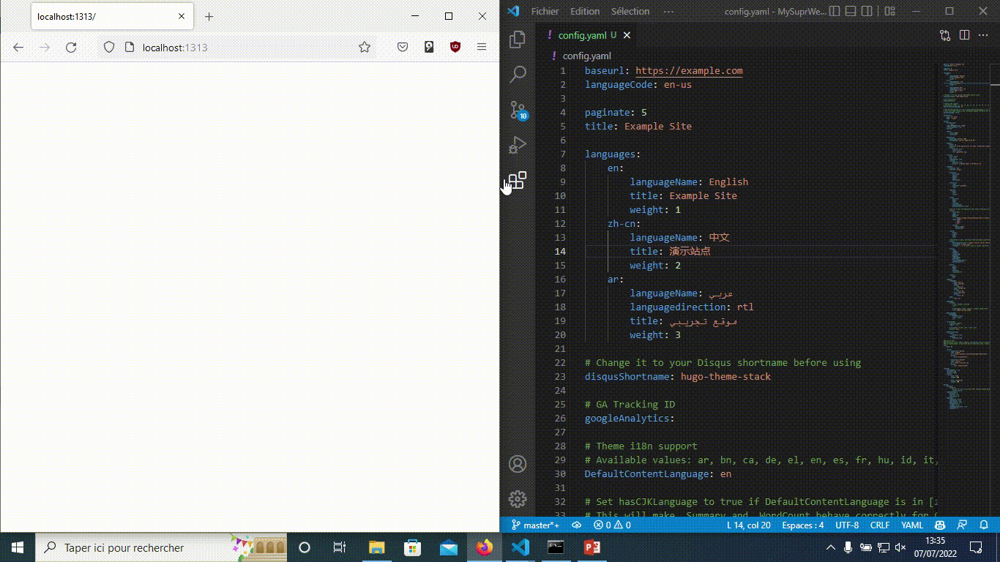
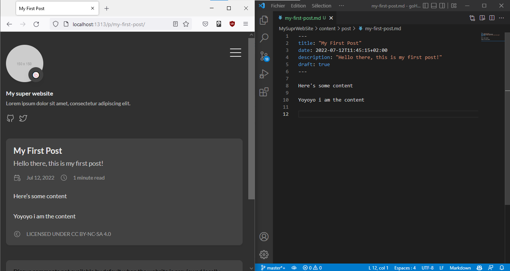

# Description

In this tutorial, we will be building our first static website with Hugo.
You can also find a more detailed tutorial of the Hugo project [here](https://gohugo.io/getting-started/).
This one aim to be a simple introducton to the Hugo project.

# Begin with Hugo

[Hugo](https://gohugo.io/) is a static site generator written in [Go](https://go.dev/).


This tutorial will help you to get started with Hugo, givning you a solid foundation to build your own static site generator and most importantly, it will help you to get familiar with the Hugo build process.

## Prerequisites

### Golang 

goHugo was written in Go (Go language - Golang), so you need to have a Go compiler and Go environment installed.

Please find the link to download [goHugo](https://go.dev/dl/)



### Hugo

#### Hugo version

We suggest you to install **Hugo extended version** for more convenience.

#### Download Hugo

There are many ways to install Hugo, we recommand to download it directly from the [GitHub repository](https://github.com/gohugoio/hugo/releases) of the project.



Even though you can use the [official release](https://gohugo.io/getting-started/installing/) of Hugo and follow their instructions.

#### Install Hugo - adding to your PATH

If you have downloaded the hugo using the above GitHub link. You will need the path to the goHugo executable.

This is the path to our executable file.



You should copy the path to the goHugo executable to your PATH environment variable. 




Now that you have installed Hugo, you can start using it.

## Build a site

First open a terminal and see if Hugo was correctly installed. You should see a similar message:


### Create the website repository

First, you need to choose a directory to store your website (in our case, we will create it) and go there.

Then you should run the following command:
```
hugo new <<the name of your website>>
```



This command will create a new directory called `<<the name of your website>>` with the following tree:


(Notice the `config.toml` file : configuration file)

You have just created a new blank website.

### Preview of your website

To see what your website looks like, you need to go to `<<the name of your website>>` folder
```
cd <<the name of your website>>
```
And run the following command:
```
hugo server -D
```

Your website should be running on http://localhost:1313/ (or equivalent at the bottom of the above image).

Note: the "-D" option means that hugo will include 'draft' pages.

So far, you can see your blank website.


```
Ctrl + C to stop the server
```

How about giving it a theme ?

### Adding a theme

#### Choosing a theme

goHugo provides a large number of themes mainly made by individuals.

You can choose the one you like* [here](https://themes.gohugo.io/).

*: Some themes are made by organizations / communities / companies, they may not have the same way of working or the same structure as traditionnal ones, for example we recommand to avoid the 'Academic' themes (for now), this tutorial is meant to be an introduction to the functionning of Hugo.

In our case, we will be using the [`stack`](https://themes.gohugo.io/themes/hugo-theme-stack/) theme.


#### Installing a theme

First of all, at the bottom of your theme page, you may find instructions to install the theme and to use it correctly - you should read them if you face any problem building your website.

If you click on the download button, you will be redirected to the GitHub repository of the theme.


**You should copy its URL**.

#### Installing the theme

With a terminal, go to your `<<the name of your website>>` folder and type the following commands:

```
git init
git submodule add <<git adress of the theme you will use to create the website>> themes/<<theme_name>>
```

This will clone the theme repository into the `themes` folder.


#### Changing the configuration file

The configuration file is located in the [`<<the name of your website>>`](#create-the-website-repository) folder.

You may edit it to your needs, but there are some things you should know:

- Hugo' default configuration file is `config.toml` (or `.yaml` or `.json`).
    - [Syntax-toml](https://toml.io/en/)
    - [Syntax-yaml](https://docs.ansible.com/ansible/latest/reference_appendices/YAMLSyntax.html)
    - [Syntax-json](https://www.w3schools.com/js/js_json_syntax.asp)
- The configuration file consists in a succession line defining the website behavior. For instance, you can define the title of your website by adding the line : `title = '<<title of your site>>'`. Same for the author, the default language, the default theme, etc.

    - You can add a theme by adding the following line : `theme = '<<theme_name>>'`.

It should look like this:



#### Noticing the changes

When you have finished installing the theme, if you type again the [commands](#preview-of-your-website):

```
cd <<the name of your website>>
```
And run the following command:
```
hugo server -D
```

You should see the theme applied to your website.


Bettter, but still quite impersonal.

### Configuration file - Make further changes

Another good way for getting familiar with the configuration file is to see an example of it.

If you go to the `<<the name of your website>>/themes/<<theme_name>>`, you will find a folder called `exampleSite` which gives you an example of a full site using this theme.

You can copy copy its configuration file and override the previous one in your `<<the name of your website>>` folder and edit it to your needs (don't forget to erase / delete the old one).

Note: you may need to change the `theme` line again

In our case, it looks like this : 


Note: always save your changes `Ctrl + S`

More information [here](https://gohugo.io/getting-started/configuration/).

**In other words**



### Adding content to your website

Now, time for adding new pages.

You can create a new blank post by typing the following command (in your `<<the name of your website>>` folder):

```
hugo new post/<<name of your post>>
```

This will create a new folder called `post` in the content folder and a new file called `<<name of your post>>` in this new folder.
When reloading your website, you should see changes on the page.


**Notice** : most of the themes take into account 'post' folders, however, some themes have other way of working (aka 'Academic').

It is a blank page, but you can add content to it.


#### Font Matter

The [*font matter*](https://gohugo.io/content-management/front-matter/) is the header of your new post.
It contains meta-data that helps Hugo to understand the content of your post.

- It begins with the line `+++` and ends with the line `+++` if your configuration file is a `.toml` file. 
- It begins with the line `---` and ends with the line `---` if your configuration file is a `.yaml` file.
- It begins with the line `{` and ends with the line `}` if your configuration file is a `.json` file. (Copilot)

The content of your font matter should be written following the [syntax](#changing-the-configuration-file) of the configuration file.

Everything in the font matter is optional. However, having at least a title to your post is quite recommended.

For more information, see the [documentation](https://gohugo.io/content-management/front-matter/).

##### Adding a description to your post

Just open your post file and add the following line :

- toml
```
description = '<<description of your post>>' 
```
- yaml
```
description : '<<description of your post>>' 
```



##### Adding custodial image (not compatible with all themes)

The first thing to do is to import the image in your website.

More precisely, you need to add it to your static folder(Hugo differentiate the textual content of a post and its static data).

In our example, we will add [this](#begin-with-hugo) image to the new folder `static/images/font_matter_images/`.

Then you need to add the following line to the font matter of your post :

- toml
```
image = 'images/font_matter_images/<<name of the image>>' 
```
- yaml
```
image : 'images/font_matter_images/<<name of the image>>' 
```


## Wanna see the end result ?

Type the following command in your terminal :

```
hugo
```

See the public folder of your website.